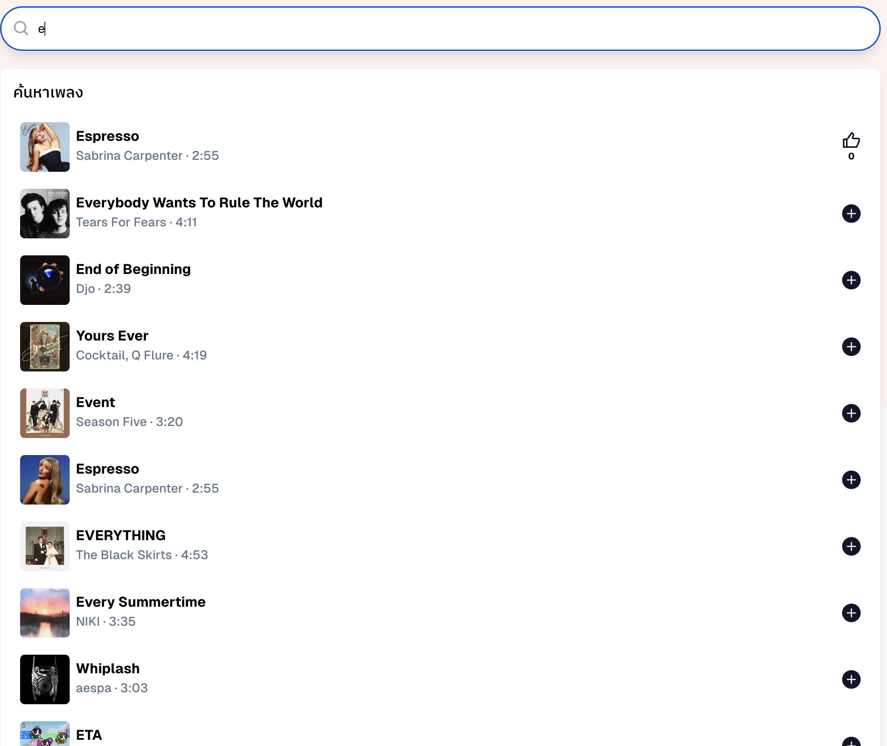
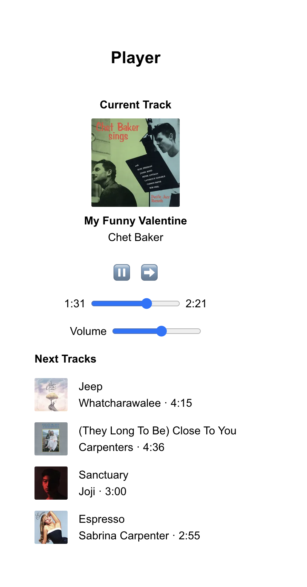
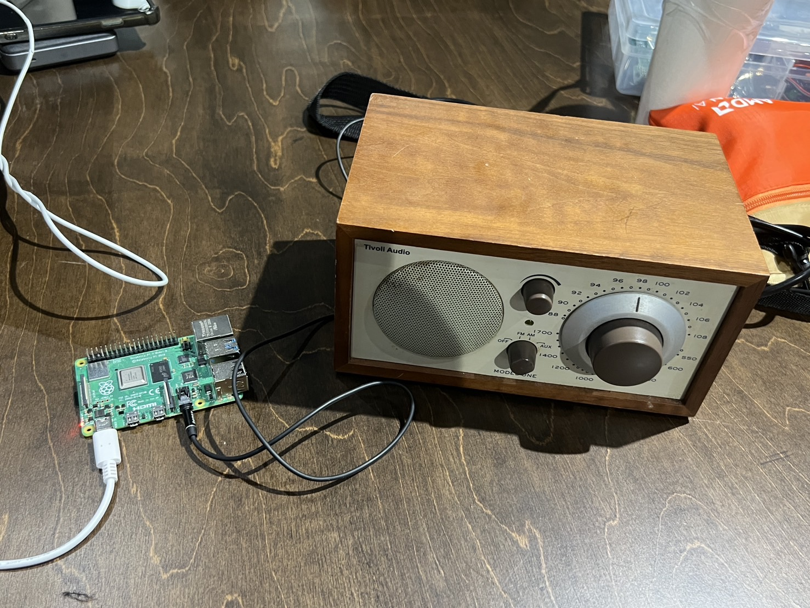

# Intania Jukebox

The web-based Spotify Web API music player for Intania Chula, powered by raspberry pi.

## Features

### Music List

### Music Player

Play music from Spotify Web API, on the web (for Spotify Premium users only).

The music is played through a speaker connected to the Raspberry Pi.

### Keypad

Control the music player using a keypad.

## Apps

### Frontend

The frontend is a web-based music player that allows users to select songs from a list and play them. The frontend is built using NextJS.

[Frontend](./frontend)

### Backend (Music Manager)

The backend service for the Intania Jukebox app.

[Backend](./music-manager)

### KeyPad

The keypad service for the Intania Jukebox app.

[KeyPad](./keypad)

## Disclaimer

This project is a part of the Intania Chula project, which is a project for the Software Development course at Chulalongkorn University. This project is not intended for commercial use.

## License

This project is licensed under the MIT License - see the [LICENSE](./LICENSE) file for details.
